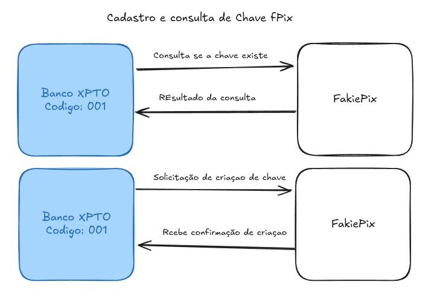

# fakiePix

## Estudo de caso:

### Sobre o projeto:

    - É uma soluçao para simular transferencias de valores entre bancos ficticios atraves de chaves (email, cpf)
    - Simula diversors bancos e contas bancarias que possuem chave fPix.
    - cada conta bancaria poderá cadastrar uma chave fPix, que poderá ser email ou cpf.
    - Uma conta bancaria poderá transferir valores para outra conta bancaria atraves da chave fPix.
    - Uma transação nao pode ser perdida mesmo que: O sistema esteja fora do ar.
    - Uma transaçao nao pode ser perdida mesmo que: O banco de destino esteja fora do ar.

### Sobre os Bancos:

    - o banco sera um microsserviço com funços limitadas a cadastro de contas e chaves pix, bem como transferencia de valores.
    - Utilizando a mesma aplicaçao para simular varios bancos, cada banco terá um id unico, nome, cores e logo.

#### Sobre as tecnologias dos bancos:

    - Nestjs no backend
    - Nextjs no frontend

## Sobre o Fakie Pix:

    - O Microserviço fakiePix é responsavel por intermediar as transações entre os bancos.
    - Receberá a transação de transferencia.
    - Encaminhará a transação para o banco de destino. (Status de pendente = "pending")
    - Recebe a confirmação do banco de destino. (Status de confirmado = "confirmed")
    - Envia confirmação para o banco de origem informando quando o banco de destido processou a transação. (Status de confirmado = "confirmed")
    - Recebe a confirmação do banco de origem. (Status de completado = "completed")
    - Marca a transação como completada. (Status de completado = "completed")

